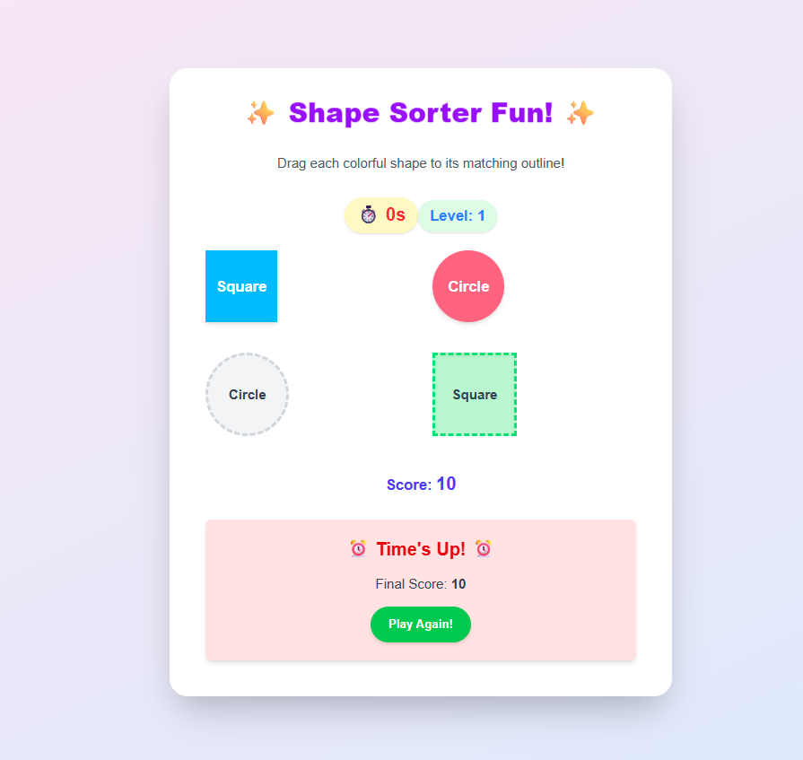

# 🧠 Cognify - Empowering Children Through Engaging Learning

Cognify is a full-stack, inclusive educational platform designed to support **children with neurological disorders** through personalized, engaging, and therapeutic learning. With modules for alphabet and number learning, voice interaction, calming activities, and parental resources, Cognify aims to create a safe and encouraging learning environment.

> 💡 Cognify blends technology, empathy, and education into a holistic solution to improve cognitive development.


---

## 🚀 Features

- 🎨 **Interactive Learning Modules**
  - Alphabet and number learning with **visuals** and **pronunciation**
  - Gamified progress with **levels and badges**
  
- 🧠 **AI Chatbot with Voice**
  - Voice recognition input (speech-to-text)
  - Voice output responses (text-to-speech)
  - Designed to improve communication and engagement

- 🧘 **Relaxation Tools**
  - In-app **meditation** and **drawing board** to aid emotional balance

- 👨‍👩‍👧 **User Profiles & Progress Tracking**
  - Each child’s progress is stored in a MongoDB database and **persistently tracked** via login

- 🧑‍🏫 **Parental Resources**
  - Curated educational materials and strategies for parents and guardians

- 📊 **Dashboard & Analytics**
  - Visual display of progress levels across modules (alphabets, numbers, etc.)

- 📍 **Fully Functional MERN Stack**
  - Vite + React frontend
  - Express + Node.js backend
  - MongoDB for data persistence

---

## 🛠 Tech Stack


---

## 🖼️ Screenshots

### 🏠 Home Page  
  
*A clean and inviting landing page introducing the Cognify platform and its mission.*

---

### 🧠 Learning Module – Alphabets  
  
*Interactive alphabet learning with visuals, sound, and level-based progress tracking.*

---

### 🔢 Learning Module – Numbers  
 
*Gamified number learning with badges and motivational feedback.*

---

### 🎮 Gamified Learning Page  

*Engaging games like Shape Sorting, Memory Match, and Colorful Puzzles designed to boost cognitive skills.*

---

### 🧩 Games – Shape Sorting  
  
*Drag-and-drop game to help children identify and match shapes intuitively.*

---

### 🗣️ AI Chatbot with Voice  
  
*Voice-enabled chatbot that engages children in friendly, responsive conversation.*

---

### 🧘 Relaxation – Meditation  

*Soothing meditation sessions to help children unwind and improve focus.*

---

### 🎨 Relaxation – Drawing  
  
*A creative canvas for kids to draw and express themselves freely with colors.*

---

### 📊 Dashboard – User Progress  
  
*Visual analytics showing module completion, scores, and individual growth.*

---

### 👨‍👩‍👧 Parent Resources  
  
*A section for parents with helpful content, articles, and activity guides.*

---


### ⚙️ Admin Dashboard (Upcoming)   
*A management panel for educators and parents to monitor user activity and progress.*


🚀 Getting Started
Follow these steps to run the project locally:

1. Clone the repository

```bash
git clone https://github.com/Atheeek/Cognify-project.git
cd Cognify-project
```

2. Install Server Dependencies

```bash
cd server
npm install
```
Create a .env file in the server folder and add your MongoDB URI:

```bash
MONGO_URI=your_mongodb_connection_string
PORT=5000
```
Start the backend server:
```bash
npm start
```

3. Install Client Dependencies

```bash
cd ../client
npm install
npm run dev
```

Now the client should be running at http://localhost:5173 and the backend at http://localhost:5000

📂 Project Structure

```bash
Cognify-project/
├── client/             # Vite + React frontend
│   └── src/
│       └── components/ # Reusable UI components
│       └── pages/      # Page-level modules
├── server/             # Express + Node backend
│   └── models/         # Mongoose schemas
│   └── routes/         # API endpoints
│   └── middleware/       
└── README.md
```

🎯 Roadmap
 Alphabet & number learning modules

 User login & progress tracking

 AI Chatbot integration with voice recognition & output

 Drawing board & meditation

 Voice recognition for speech feedback

 Multiplayer memory games

 Admin dashboard for parents/educators


 📬 Contact
Made with ❤️ by Atheeek

📧 Email: your.atheek163@gmail.com

💼 LinkedIn: [linkedin.com/in/your-profile](https://www.linkedin.com/in/mahammad-atheek-rahman-657533253/)

🌐 Portfolio: www.atheek.com

"Technology becomes powerful when it uplifts and includes. Cognify is built to do both."
